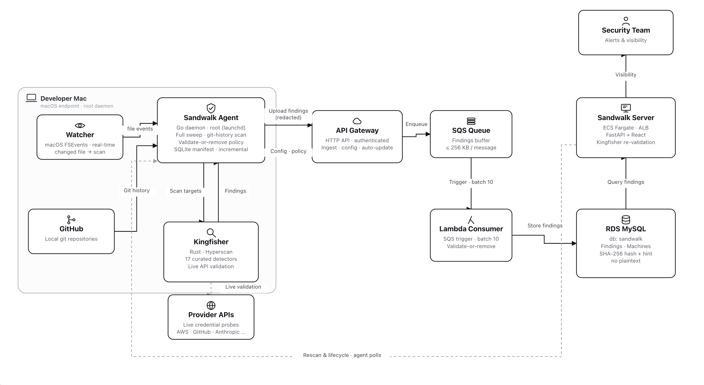

# Sandwalk


**Sandwalk** is an open-source, continuous **endpoint secrets scanner** for macOS developer fleets. It ships as a single compiled Go binary running as a root LaunchDaemon, finds leaked credentials on each machine, **validates them live** against their provider APIs, and reports only **confirmed-active** secrets to a self-hosted dashboard — without ever storing the plaintext centrally.

## Overview

Developer laptops are where live credentials actually sit: `~/.aws/credentials`, an `.npmrc` with a publish token, a GitHub PAT in a shell profile, a service-account JSON in `~/Downloads`. Repository scanners and SIEMs watch the repo and the network — nobody watches the endpoint. That gap is exactly what supply-chain attackers harvest: a stolen npm or PyPI token becomes a malicious package release, a GitHub PAT poisons CI, an AWS or GCP key becomes an infrastructure pivot.

Sandwalk closes that gap. It continuously scans each Mac with a single detection engine, network-validates every candidate against the real provider, and surfaces only credentials that are **live right now** — so the security team sees a short, high-signal list of secrets that are genuinely exploitable, tied to a specific machine, and worth rotating today.

Because it runs across the **whole fleet**, Sandwalk is also a **live inventory of your exposure**: at any moment you can see exactly which credentials exist on which machine, and whether they are still valid. That inventory is what turns a supply-chain incident from a guessing game into an answer. When a poisoned npm or PyPI package harvests tokens off developer machines — the Shai-Hulud worm being the archetype — the only question that matters is **"what did we lose?"** Sandwalk answers it directly: which secrets sat on the affected machines, which are still live, and which to rotate first — instead of assuming the worst across the entire org and rotating blind.

## 🧨 Threat Model

- **The endpoint is unmonitored.** Secret scanning happens in CI and in git remotes; the working tree and the developer's home directory are blind spots.
- **Live credentials leak in the clear.** Tokens end up in dotfiles, config, downloaded JSON, and old commits — usable the moment they are read.
- **Rotation is invisible.** A secret deleted from a file may still be active on the service; nobody re-checks the provider, so a "removed" credential stays exploitable.
- **Noise kills scanners.** Regex-only tools drown teams in dead and invalid matches, so real leaks get lost.

Sandwalk is built around the assumption that **only a validated, still-active credential is worth an alert** — everything else is noise or already-fixed.

## ✨ Key Features

- **Fleet-wide exposure inventory** — one dashboard shows every live secret across every machine, continuously updated; after a supply-chain compromise you know exactly what was exposed and what to rotate, instead of rotating the whole org blind
- **Continuous endpoint coverage** — a single compiled Go binary runs as a root macOS LaunchDaemon on every developer Mac; no per-project setup
- **Three detection modes, one engine** — a real-time FSEvents watcher, an incremental daily sweep, and a git-history walker, all powered by [MongoDB Kingfisher](https://github.com/mongodb/kingfisher) (Rust, Hyperscan, 958 rules)
- **17 supply-chain detectors** — AWS, GCP, GitHub (classic & fine-grained PATs, OAuth), GitLab, Stripe, Razorpay, OpenAI, Anthropic, npm, PyPI, DockerHub, and SSH/TLS private keys
- **Validate-or-remove** — every finding is network-validated live against its provider; only confirmed-active secrets surface, so the dashboard carries no false-positive noise
- **removed·live tracking** — a distinct `removed_active` status for a secret deleted from a file but still live on the service — the moved-but-not-rotated case, tracked explicitly
- **Hash-only central store** — the server never holds plaintext; it stores only a value hash and a masked hint (`sk-ant-…MIJS`, prefix + last-4)
- **Ships as a `.pkg`** — auto-updates over S3 with a semver downgrade guard; the dashboard is self-hosted

## 🔍 How It Works

Sandwalk runs one detection engine — Kingfisher, scoped via `--rule` to 17 supply-chain detectors — and feeds it from three complementary sources.

### Three detection modes

1. **Real-time watcher** — a macOS **FSEvents** watcher scans each file the moment it is created, modified, or renamed, and uploads any finding immediately. The Go walker `lstat`s first and only ever hands regular files to Kingfisher, so FIFOs/sockets/special files can never block a scan.
2. **Incremental sweep** — a SQLite **manifest** (`path, size, ctime, inode, ruleset`) records what has been scanned, so a **wall-clock–anchored daily sweep** re-scans only files whose `ctime`/`inode`/`size` changed. The first sweep is a full baseline; a ruleset change invalidates the manifest and forces a re-scan.
3. **Git history walker** — Kingfisher walks each repo's commit history, surfacing secrets that were **committed and later deleted** from the working tree, with the commit hash, author, and date.

### Validate-or-remove

Every candidate is **validated live** against its provider before it is ever shown:

- **Active** → flagged as a real, usable credential.
- **Inactive** → marked **rotated**.
- **Unvalidatable** → **silently dropped** — no noise, no false positives.

The one exception is **SSH/TLS private keys**, for which no network validator exists. The owner's own `~/.ssh` keys are kept and shown with their **passphrase status** — a passphrase-less key is immediately usable and therefore the dangerous case. SSH findings are **medium** severity.

### removed·live state

When a secret disappears from a file, the agent re-validates the old value. If it is now **rotated**, the finding is closed. If it is **still live** — moved elsewhere but never rotated — it is tracked as a distinct **`removed_active`** status — the moved-but-not-rotated case, surfaced explicitly.

### Hash-only privacy

The central store is designed so it **cannot leak what it never holds**. The server keeps only a **value hash** and a **masked hint** (prefix + last-4). Validation always happens **on the endpoint** where the secret physically lives — "**Re-validate on device**" dispatches a rescan, and the agent re-checks liveness locally and returns **only the verdict**. Plaintext never leaves the machine.

## 🏗️ Architecture



Findings flow **agent → API Gateway → SQS → consumer Lambda → MySQL (RDS) → Sandwalk Server (ECS)**. The server receives only hashes and masked hints; any live re-check is dispatched back to the device that holds the secret, which polls the API for its rescan and lifecycle work.

## 📦 Installation

### Prerequisites

- **macOS** (Apple Silicon) with **Xcode Command Line Tools** (`pkgbuild`)
- **Go 1.26+**
- **Kingfisher** on the build host — `brew install kingfisher`
- For fleet rollout: an **MDM** (e.g. JumpCloud) able to push a `.pkg` to a device group

### Build from source

```bash
git clone <your-repo-url>
cd sandwalk
bash build.sh 1.3.8
```

This compiles the Go agent, bundles Kingfisher, and produces `releases/Sandwalk-1.3.8.pkg`. The agent API key is injected at build time from `AGENT_KEY` (env) or `~/.sandwalk-signing/agent-key` and is **never committed to the repo**.

### Deploy to the fleet

Push the `.pkg` to the target Mac device group through your MDM. Fleet rollout is documented in [`setup/`](setup/).

## 🔄 Finding Lifecycle

| Status | Meaning |
|--|--|
| `active` | Validated **live** against its provider — a real, usable credential. **Rotate it.** |
| `removed_active` | Removed from the file but **still live** on the service — moved, not rotated. |
| `rotated` | Found **inactive** on (re-)validation — no longer usable; closed automatically. |
| _dropped_ | Could not be validated — **silently discarded**, never surfaced (no false positives). |
| SSH / TLS key | No network validator; owner's `~/.ssh` keys are kept and shown with **passphrase status** (medium severity). A passphrase-less key is the dangerous case. |

## 🗂️ Repository Layout

| Path | What |
|------|------|
| `agent/` | Go agent — FSEvents watcher, incremental sweep, git-history walker, Kingfisher wrapper, uploader, auto-update |
| `server/` | FastAPI dashboard + API (`/api/scans`, `/api/findings`, `/api/machines`, …) |
| `dashboard/` | React admin UI (built and served by `server/`) |
| `setup/` | LaunchDaemon plist, install scripts, and code-signing setup |
| `terraform/` | AWS infra — API Gateway, SQS, consumer Lambda, RDS, ECS |
| `build.sh` | Builds the `.pkg` (Go binary + bundled Kingfisher) |

## 🔒 Security

- **No plaintext at rest** — the central store holds only value hashes and masked hints; the full secret lives only in the file on the endpoint.
- **On-device validation** — every liveness check runs where the secret physically is; the dashboard dispatches a re-check and receives only a verdict, so it can't leak what it never holds.
- **Confirmed-active findings are real leaked credentials** — they are validated as usable. **Rotate them.**

## 📄 License

Released under the [Apache License 2.0](LICENSE).
